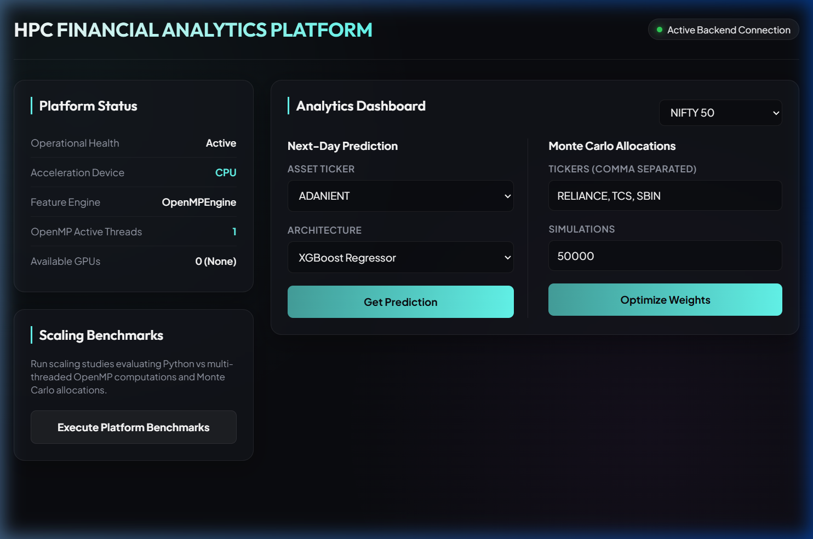

# AI-Driven Stock Market Prediction and Portfolio Optimization

An enterprise-grade, high-performance financial analytics platform that predicts future stock prices and recommends optimized investment portfolios, designed for High Performance Computing (HPC) environments.

---

## 📖 Project Overview

This platform provides end-to-end quantitative financial workflows, from data ingestion to model training and portfolio optimization:
- **Feature Pipeline**: Computes core indicators (RSI, SMA, EMA, MACD, Bollinger Bands, Volume, Volatility) using C/OpenMP on Linux and a Python fallback on Windows.
- **Deep Learning & Boosting**: Trains LSTM, Transformer, and XGBoost models on historical NIFTY 50 stock data.
- **Portfolio Optimization**: Directs capital allocation based on Sharpe Ratio maximization and Monte Carlo simulations.
- **Serving & Presentation**: Integrates a local FastAPI REST service for low-latency inference and a premium Dashboard featuring glassmorphic designs, responsive pages, and Chart.js dynamic visualizations.

---

## 📸 Dashboard Preview

Below is the verified premium dashboard displaying stock predictions and Monte Carlo portfolio weight allocations:



---

## 🏗️ Clean Architecture & Package Layout

The project follows clean architecture principles. Core business logic is decoupled from delivery mechanisms:

```
stockproject/
├── ai_engine/           # Reusable core library (installable python package)
│   ├── data/            # SQLite storage & yfinance data ingestion
│   ├── features/        # Technical indicator calculation (Python & C/OpenMP)
│   ├── models/          # Model declarations (XGBoost, LSTM, Transformer)
│   ├── evaluation/      # Quantitative metrics (RMSE, MAE, MAPE, R²)
│   ├── hpc/             # C/OpenMP compiler scripts and CUDA utilities
│   ├── training/        # PyTorch and XGBoost training loops (CUDA-ready)
│   ├── portfolio/       # Optimization algorithms (Sharpe, Monte Carlo)
│   └── utils/           # Configuration parsing & log configurations
├── backend/             # FastAPI REST Server (serves predictions & allocations)
├── frontend/            # Vanilla JS/CSS static Dashboard served with Nginx/Chart.js
├── notebooks/           # Jupyter Notebooks for pipeline walkthroughs
├── saved_models/        # Shared weights, scalers, and training configs
├── docs/                # Architecture docs, guides, and internship reports
├── scripts/             # Python CLI automation tools (predict.py, train_ru.py)
├── .env.example         # Template settings
├── pyproject.toml       # Manifest enabling editable package discovery
├── requirements.txt     # Production runtime dependencies
└── requirements-dev.txt # Testing & code formatting dependencies
```

---

## 💻 Hybrid Multi-Environment Workflow

To optimize computing resource usage, development is divided across two environments:

```
[ Local Windows Laptop ]                                 [ RU HPC Cluster ]
 (VS Code, React, FastAPI)                                (JupyterLab, A100 GPU)
            │                                                      ▲
            │ 1. Code developments                                 │ 3. Git Pull code
            ▼                                                      │
      [ GitHub Repo ] ─────────────────────────────────────────────┘
            │
            │                                     4. Train Models (CUDA)
            │                                     5. Compile Features (OpenMP)
            │                                                      │
            ▼                                                      ▼
      [ git pull ] ◄──────────────────────────────────────── [ git push weights ]
            │ (Or copy saved_models/ back to Windows)
            ▼
 6. Local FastAPI Inference (CPU)
 7. React UI Visualizations
```

1. **Development & UI serving (Local Windows Laptop)**:
   - React UI and FastAPI API serve locally.
   - Inference runs locally on CPU utilizing saved model weights.
   - Python fallbacks execute technical indicator calculations.
2. **HPC Workloads (Ramanujan Universe Cluster - Linux)**:
   - GPU-accelerated training (NVIDIA A100) using PyTorch CUDA.
   - Cython compilation for high-speed technical indicator calculations using OpenMP.
   - Training runs are executed via Jupyter notebooks or the `train_ru.py` script.

---

## 📦 Pre-trained Models

To maintain a clean and lightweight source repository, all generated model checkpoints (`saved_models/`) and cached datasets (`data/nifty500/`, etc.) are excluded from version control (via `.gitignore`). 

After the final project release is published, the official pre-trained models will be distributed separately as a GitHub Release artifact.

You can bootstrap the local environment with all pre-trained weights by running:
```bash
python scripts/fetch_models.py
```

---

## ⚙️ Setup and Installation

### Windows Local Setup

1. **Prerequisites**: Ensure Python 3.8+ and Node.js (v18+) are installed.
2. **Virtual Environment**:
   ```powershell
   python -m venv .venv
   .venv\Scripts\Activate.ps1
   ```
3. **Dependencies Installation**:
   - Install production packages:
     ```powershell
     pip install -r requirements.txt
     ```
   - Install developer tooling:
     ```powershell
     pip install -r requirements-dev.txt
     ```
4. **Install core package**:
   ```powershell
   pip install -e .
   ```
5. **Set up Environment Settings**:
   ```powershell
   copy .env.example .env
   ```
   Open `.env` and verify that configurations point to your local workspace paths.

### Ramanujan Universe (RU) Linux Cluster Setup

1. **Clone project**:
   ```bash
   git clone https://github.com/yourusername/stockproject.git
   cd stockproject
   ```
2. **Set up Environment**:
   Verify PyTorch with CUDA support is preinstalled:
   ```bash
   python -c "import torch; print('CUDA Available:', torch.cuda.is_available())"
   ```
3. **Editable Installation & Compiling Extensions**:
   Install runtime requirements and build the package:
   ```bash
   pip install -r requirements.txt
   pip install -e .
   ```
4. **Compile OpenMP features manually (Optional)**:
   - **Linux / Ramanujan Universe Cluster (GCC)**:
     ```bash
     python setup.py build_ext --inplace
     ```
   - **Windows (using MinGW GCC)**:
     ```powershell
     $env:PATH = "C:\msys64\ucrt64\bin;" + $env:PATH
     python setup.py build_ext --compiler=mingw32 --inplace
     ```

---

## 📓 Running Jupyter Notebooks

Our notebooks contain minimal execution steps, importing core functions directly from `ai_engine`:
1. Launch Jupyter from the virtual environment:
   ```powershell
   jupyter lab
   ```
2. Open and run:
   - `01_data_ingestion.ipynb`: Downloads stock data from yfinance and stores it in SQLite database.
   - `02_feature_engineering.ipynb`: Generates technical indicators (with OpenMP parallel loops on RU).
   - `03_model_training.ipynb`: Triggers LSTM, Transformer, and XGBoost model training.
   - `04_portfolio_optimization.ipynb`: Generates optimal portfolios using Monte Carlo simulations.

---

## 🚀 Serving & Deployment Pipelines

### 1. Local Development Execution
To serve the backend API locally:
```powershell
uvicorn backend.main:app --reload
```
To run the static frontend locally:
Simply open [frontend/index.html](file:///d:/stockproject/frontend/index.html) in any modern browser, or serve it using a simple HTTP server (`python -m http.server 80`).

### 2. Containerized Production Deployment
The application is fully containerized using Docker and Docker Compose. This orchestrates both the FastAPI backend and Nginx frontend servers in isolated environments.

**Prerequisites**:
Before running the deployment, ensure the pre-trained weights are present. In production, these are downloaded via the release bootstrap script:
```bash
python scripts/fetch_models.py
```

**Launch Stack**:
Spin up the containerized application using:
```bash
docker-compose up --build
```
Once the stack is active:
* **Frontend Dashboard**: Open `http://localhost` (Port 80)
* **Backend REST API**: Accessible at `http://localhost:8000` (Swagger UI at `http://localhost:8000/docs`)

---

## 🗓️ Development Status & Final Phases
All quantitative, OpenMP feature acceleration, deep learning prediction, portfolio optimization, and frontend charting phases are complete and verified. Containerized configurations are fully deployed.
